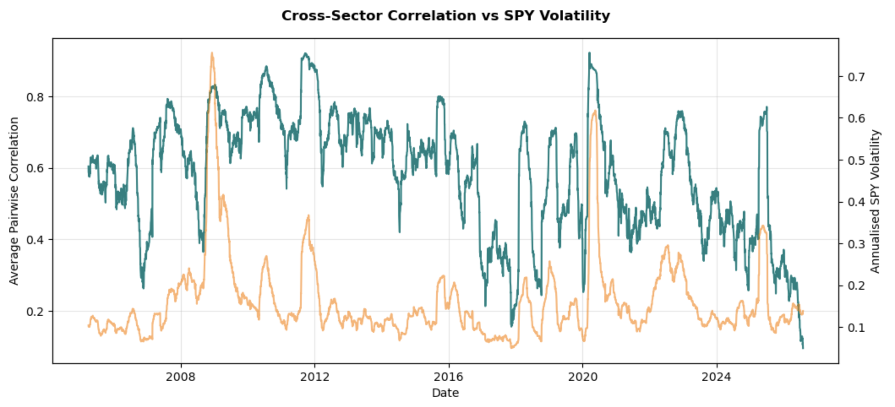
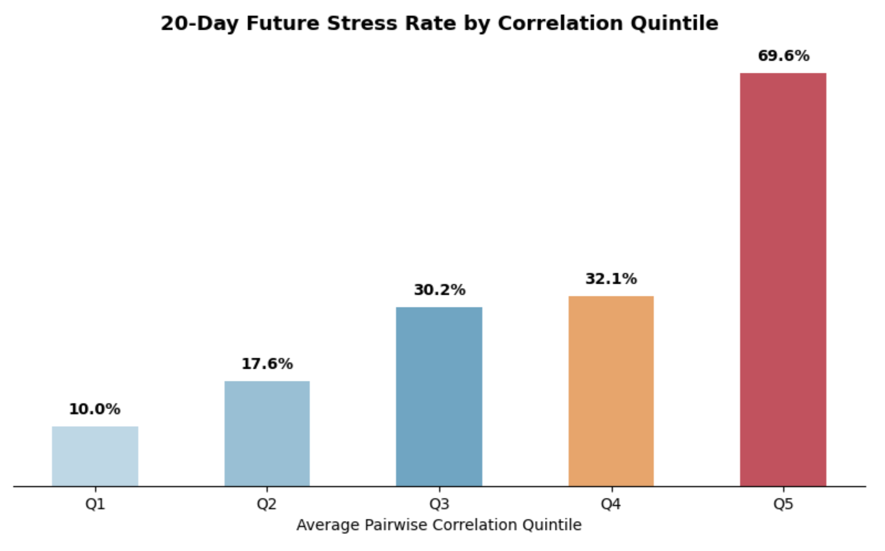
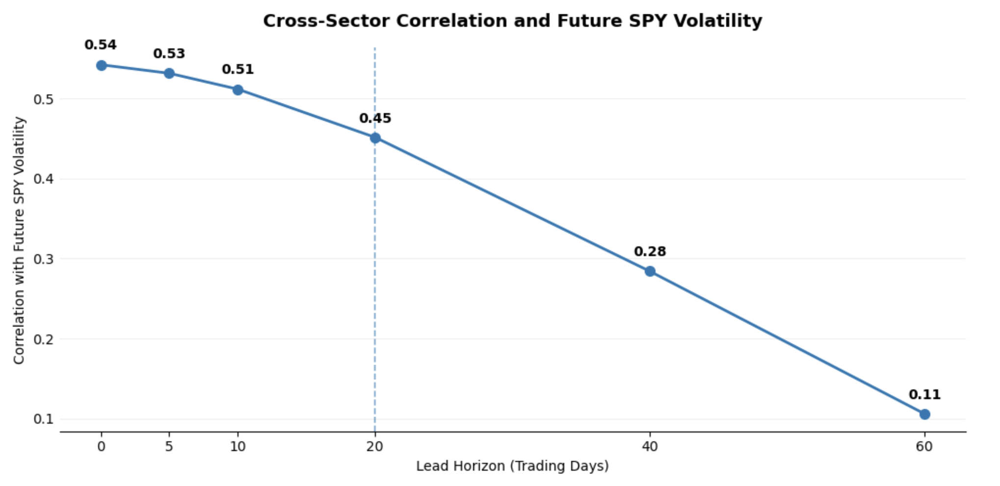
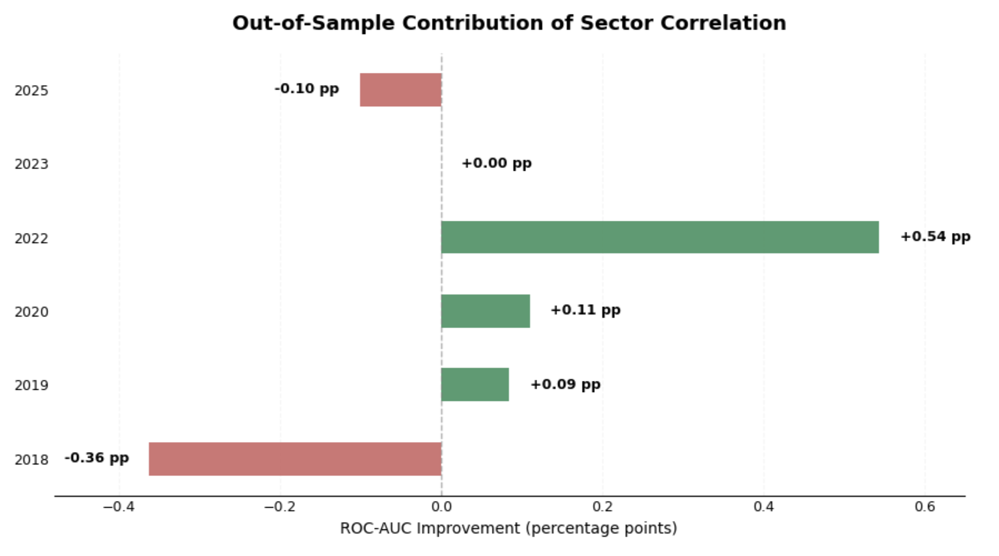
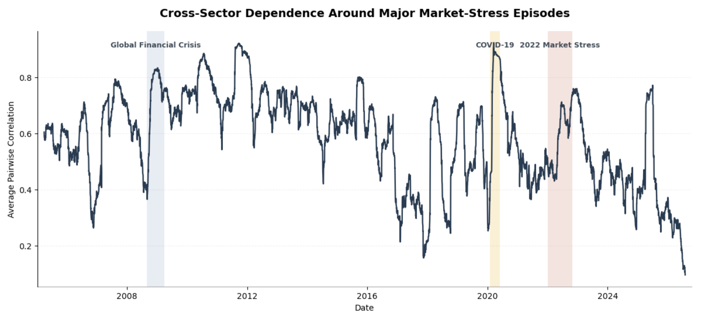
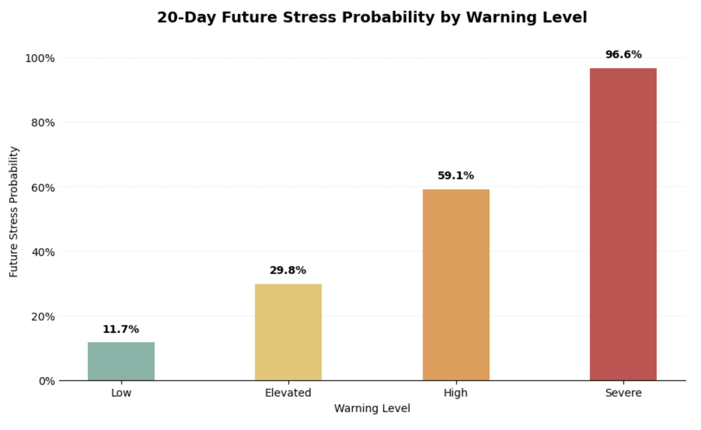

# Financial Market Early-Warning System

## Overview

This project investigates whether changes in cross-sector market dependence can provide useful early-warning information about future financial stress.

The main idea is that during periods of market instability, sector returns often become more closely connected as diversification weakens and assets begin moving together. The analysis tests whether this change in market structure contains useful information beyond conventional volatility measures.

The study uses daily data for the S&P 500 (SPY) and nine US sector ETFs from January 2005 to July 2026. Rolling correlation, market volatility, stress probabilities and out-of-sample predictive tests are used to evaluate the hypothesis.

---

## Research Question

**Can rising cross-sector correlation provide useful information about future market stress beyond what is already captured by market volatility?**

The analysis focuses on three related questions:

- Does cross-sector correlation increase during periods of financial stress?
- Is higher correlation associated with greater future market stress?
- Does correlation improve out-of-sample prediction when added to a volatility-based model?

---

## Methodology

The analysis follows the market through time rather than relying only on a full-sample relationship.

The main steps are:

1. Collect daily adjusted market prices for SPY and nine US sector ETFs.
2. Calculate daily log returns.
3. Estimate rolling 60-day pairwise correlations between sectors.
4. Construct an average pairwise correlation measure as an indicator of market-wide dependence.
5. Measure market volatility and identify stress conditions.
6. Examine the relationship between correlation and future stress over a 20-trading-day horizon.
7. Compare volatility-only and volatility-plus-correlation predictive models.
8. Evaluate performance using chronological and expanding-window out-of-sample tests.
9. Validate the behaviour of the indicator around major historical stress episodes.
10. Combine volatility and correlation information into a composite early-warning indicator.

---

## Data

The analysis covers **January 2005 to July 2026** and uses:

- SPY as the broad US equity-market proxy
- Nine US sector ETFs to measure cross-sector dependence

Market data is retrieved programmatically from Yahoo Finance using `yfinance`.

Raw and processed market datasets are not distributed with the repository. They can be reproduced by running the data collection and preparation sections of the notebook.

Further information is available in [`data/README.md`](data/README.md).

---

## Cross-Sector Correlation and Market Volatility

The first part of the analysis compares changes in average sector correlation with market volatility.

Periods of market disruption are generally associated with stronger co-movement across sectors, although the relationship is not constant through time.



The contemporaneous relationship between average pairwise correlation and SPY volatility is approximately **0.54**, showing that the two measures are related but do not capture exactly the same information.

---

## Correlation and Future Market Stress

To examine the forward-looking relationship, observations are divided into correlation quintiles and compared with the probability of market stress over the following 20 trading days.



Future stress probability rises from approximately **10.0% in the lowest correlation quintile to 69.6% in the highest quintile**.

This provides evidence that periods of unusually high cross-sector dependence are associated with a substantially greater probability of subsequent market stress.

---

## Lead-Lag Analysis

The lead-lag analysis examines whether changes in correlation occur before, during or after changes in market volatility.



The results suggest that correlation contains some forward-looking information, but the relationship varies across horizons. This is important because an early-warning indicator needs to provide information before stress becomes fully visible in conventional volatility measures.

---

## Out-of-Sample Predictive Test

The main predictive comparison evaluates two models:

- **Volatility-only model**
- **Volatility + sector correlation model**

In the initial chronological held-out test:

| Model | ROC-AUC |
|---|---:|
| Volatility only | 0.948 |
| Volatility + Correlation | 0.954 |
| Improvement | +0.006 |

Adding sector correlation improves predictive performance, but the improvement is modest.



A more demanding expanding-window evaluation shows that the improvement is not stable across every test period. The mean ROC-AUC improvement is approximately **0.00046**, with the combined model outperforming the volatility-only model in **50% of the test blocks**.

This suggests that sector correlation provides incremental information, but not a consistently superior standalone forecasting signal.

---

## Historical Stress Validation

The behaviour of cross-sector correlation is also examined around major market disruptions, including the Global Financial Crisis, the COVID-19 shock and the 2022 market stress period.



The strongest increases in market dependence occur around severe systemic events. The magnitude differs across episodes, showing that not every period of market stress develops through the same correlation structure.

---

## Composite Early-Warning Indicator

The final stage combines standardized market volatility and cross-sector correlation into a composite warning score.

The score is classified into four warning levels:

- Low
- Elevated
- High
- Severe



The probability of future stress increases strongly across these warning categories:

| Warning Level | Future Stress Probability |
|---|---:|
| Low | 11.7% |
| Elevated | 29.8% |
| High | 59.1% |
| Severe | 96.6% |

The composite indicator therefore provides a simple way to translate changes in volatility and market structure into interpretable risk states.

---

## Key Findings

The analysis provides partial support for the original hypothesis.

- Higher cross-sector correlation is strongly associated with greater future market stress.
- Correlation increases substantially around major systemic market disruptions.
- Cross-sector dependence contains information that is not fully captured by volatility alone.
- Adding correlation to a volatility-based model produces modest out-of-sample improvements, but those gains are not consistent across all periods.
- The strongest practical use of correlation appears to be as a **complementary market-structure indicator**, rather than as a replacement for conventional volatility measures.
- Combining volatility and correlation provides a clearer separation between low- and high-risk market states.

---

## Limitations

Several limitations should be considered when interpreting the results.

- Sector ETFs are used as proxies for broad market structure.
- Results depend on the selected rolling window and stress definition.
- Predictive models are intentionally simple and are designed to test incremental information rather than maximise forecasting performance.
- The predictive contribution of correlation varies through time.
- Historical relationships may change as market structure evolves.
- The composite warning indicator should not be interpreted as evidence that correlation alone predicts future stress.

---

## Repository Structure

```text
Financial_Market_Early_Warning_System/
│
├── data/
│   └── README.md
│
├── images/
│   ├── 01_correlation_volatility.png
│   ├── 02_stress_quintiles.png
│   ├── 03_lead_lag.png
│   ├── 04_auc_improvement.png
│   ├── 05_crisis_validation.png
│   └── 06_warning_levels.png
│
├── Early_Warning_System.ipynb
├── requirements.txt
├── LICENSE
└── README.md
```

---

## Installation and Usage

Clone the repository:

```bash
git clone https://github.com/shabbarhasnainkhan/Financial_Market_Early_Warning_System.git
cd Financial_Market_Early_Warning_System
```

Install the required Python packages:

```bash
pip install -r requirements.txt
```

Launch Jupyter Notebook:

```bash
jupyter notebook
```

Open `Early_Warning_System.ipynb` and run the notebook from top to bottom. The required market data will be downloaded programmatically during execution.

---

## Tools and Libraries

- Python
- Jupyter Notebook
- pandas
- NumPy
- Matplotlib
- yfinance
- scikit-learn

---

## Reproducibility

Raw and processed market data files are not included in this repository due to third-party data usage considerations.

The notebook retrieves the required market data programmatically from Yahoo Finance using `yfinance` and performs the complete data preparation, feature construction, modelling and evaluation process.

This allows the analysis to be reproduced by running the notebook from the beginning.

For further information about the data, see [`data/README.md`](data/README.md).

---

## Conclusion

The results show that changes in cross-sector market dependence contain useful information about financial stress.

Periods of high cross-sector correlation are associated with substantially greater probabilities of future stress, while major historical market disruptions generally coincide with stronger sector co-movement.

However, the out-of-sample improvement from adding sector correlation to a volatility-based model is small and varies across time. The evidence therefore supports using cross-sector correlation as a **complementary early-warning indicator**, rather than as a standalone replacement for conventional volatility measures.

Overall, the findings provide partial support for the original hypothesis: market structure contains meaningful forward-looking information, but its predictive value is modest and time-varying.

---

## License

This project is licensed under the MIT License. See the [LICENSE](LICENSE) file for details.
